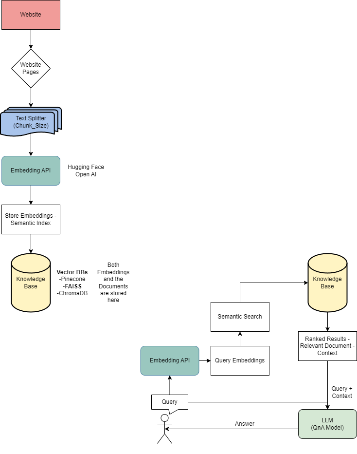
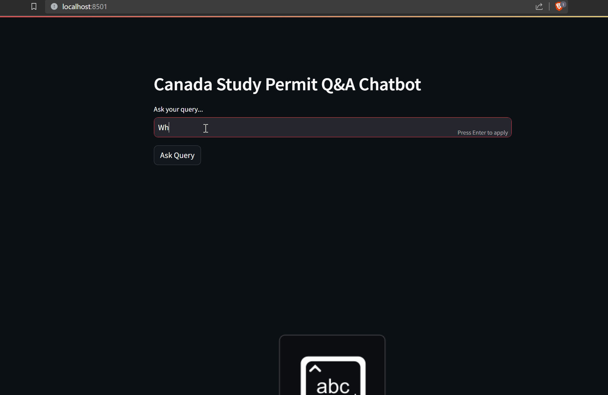
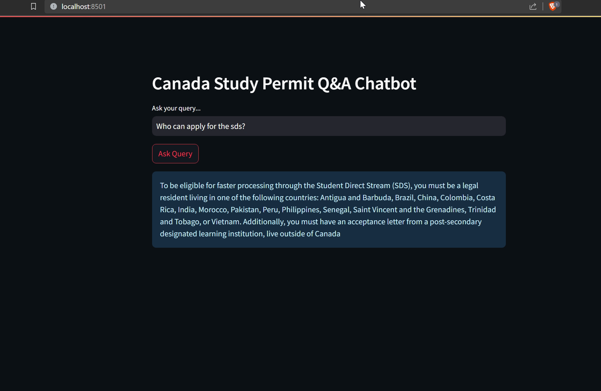

# Canada Study Permit RAG Chatbot

**A Streamlit chatbot that answers Canadian study-permit questions by retrieving from scraped Government-of-Canada pages and generating with Mixtral-8x7B-Instruct.**

I built this because I was an international student applying for a Canadian study permit, and I spent hours hunting across ten IRCC pages to answer questions that should take thirty seconds. A naive LLM would hallucinate wrong answers for legal content; a retrieval-augmented pipeline grounds the answer in the actual IRCC text. So I scraped the Student Direct Stream (SDS) documentation, chunked it, embedded it into a FAISS index, and served a LangChain `stuff` QA chain over a minimal Streamlit UI, with Mixtral-8x7B-Instruct as the generator.



---

## Problem

The Government of Canada's Student Direct Stream documentation is spread across four long pages (overview, eligibility, how to apply, after you apply). For an applicant, the answer to a single question ("what bank drafts are accepted?", "which countries are SDS-eligible?", "what happens after I submit biometrics?") usually lives buried inside one specific section of one specific page. Ctrl+F works if you know the exact phrase IRCC used. Most applicants don't.

A naive LLM is worse than Ctrl+F for this task: it will confidently hallucinate an answer, and for legal/immigration content, a hallucinated answer is actively harmful. "ChatGPT told me" is not a defence when an officer refuses your application.

A retrieval-augmented setup keeps the model grounded: it retrieves the actual IRCC chunk before generating, so the answer stays anchored to the source text. I wanted to see how far a pure-retrieval approach could get without any fine-tuning.

## Retrieval vs fine-tuning — the fork in the road

Before writing any code, I had to pick between two paths: fine-tune a model on IRCC Q&A pairs, or build a retrieval pipeline over the raw pages. I picked retrieval, for three honest reasons:

1. **IRCC rules change.** Eligibility country lists and processing times get updated. A fine-tuned model freezes the information at training time; a retrieval system is as fresh as the most recent scrape. Re-running a scraper is an hour. Re-running a fine-tune is a day and a GPU.
2. **I didn't have Q&A pairs.** I had four pages of government prose. Synthesising Q&A pairs from that text with another LLM and then fine-tuning on those pairs is a long chain of error accumulation. Retrieval skips the synthesis step entirely.
3. **Hallucination risk is worse for fine-tuned models on legal text.** A fine-tuned model will generate confidently even when the question is out-of-distribution. Retrieval at least gives the generator a chance to say "the retrieved context doesn't cover this".

The tradeoff I accepted: retrieval needs a good chunking strategy, and "good chunking" is way harder than the tutorials make it sound. More on that below.

## Why each piece of the stack

**Why FAISS over Pinecone / Weaviate / Chroma.** Local and free. My corpus is four pages; the entire embedded index fits in a few megabytes of RAM. Spinning up a managed vector DB for this is like renting a warehouse to store a shoebox. FAISS builds in memory on startup, searches in microseconds, and the whole project stays dependency-light. If the KB grew past a few thousand chunks I'd re-evaluate, but for a prototype FAISS is strictly the right default.

**Why Mixtral-8x7B-Instruct over GPT-3.5 / GPT-4.** Three reasons: (1) it was at the top of the HuggingFace open instruct leaderboard when I built this, (2) it's open-weight — I wanted the project to be fully reproducible without a paid OpenAI key, and (3) I wanted to learn the HuggingFace Hub serving path, not the OpenAI SDK. Mixtral's mixture-of-experts architecture (8 experts, 2 active per token) gives it GPT-3.5-class instruction following at a much lower effective compute cost, which matters when you're routing through a free inference endpoint. Temperature is 0.2 — low enough to keep the model pinned to the retrieved context, high enough to phrase the answer naturally.

**Why HuggingFace Hub over the OpenAI API.** The learning goal was the moat. If I glued together an OpenAI key and LangChain, I'd have a demo but no actual understanding of the model-serving layer. Using the HF Hub forced me to think about inference endpoints, rate limits, tokeniser alignment, and model selection. Also: the HF Hub route costs nothing on the free tier, which matters for a solo side-project nobody is paying me to build.

**Why Streamlit over Flask / FastAPI.** The product is "a text box and an answer". I don't need routes, auth, database models, or server-side rendering. Streamlit gives me a UI for free, re-runs the Python file on input, and deploys in one command. Writing a Flask app for this would be performative engineering.

**Why `sentence-transformers/all-MiniLM-L6-v2` for embeddings.** 384-dim, fast on CPU, good enough for short-passage retrieval on English government prose. I didn't benchmark against bigger models (MPNet, BGE, E5) because the retrieval step was visibly returning the right IRCC chunks for my test queries. Premature embedding-model optimisation is a classic RAG trap.

## Data collection — the unglamorous part

I originally wanted to scrape more of the IRCC site. I kept the scraper narrowly scoped to the SDS pages to stay polite and to keep the corpus focused. Within that scope:

- `requests` + `BeautifulSoup` fetch each page
- `soup.get_text()` rips out the rendered text
- `' '.join(text.split())` collapses all whitespace (newlines, tabs, double-spaces) into single spaces
- Each page becomes a single row in a CSV

The whitespace-collapse decision turned out to matter for chunking. The original HTML has a lot of visual indentation that has no semantic meaning; collapsing it means the chunker doesn't treat a table-of-contents indent as a paragraph boundary. But it also means I lost paragraph breaks entirely, which hurt later — see chunking.

I did consider scraping with something richer (Playwright for JS-rendered pages, `trafilatura` for readability-style extraction). For the four SDS pages, plain `requests` + `BeautifulSoup` was enough. Don't over-engineer step one.

## Chunking strategy — the hardest part, honestly

This is the thing the tutorials lie about. "Just use `RecursiveCharacterTextSplitter`" is the answer nobody should accept. Chunk size and overlap directly drive retrieval quality, and the right numbers are corpus-dependent.

What I tried:

1. **`chunk_size=500, chunk_overlap=0`** — too small. A single IRCC "eligibility requirement" bullet got split across two chunks and the model lost the thread.
2. **`chunk_size=2000, chunk_overlap=200`** — too big. Top-k retrieval would pull a big chunk that was technically relevant but also contained 1500 tokens of unrelated procedural text, diluting the signal and pushing the LLM toward hallucination.
3. **`chunk_size=1000, chunk_overlap=0`** — the current setting. A single chunk covers roughly one IRCC sub-heading. Zero overlap because the whitespace-collapsed text has no natural paragraph breaks anyway; overlap would just duplicate arbitrary character boundaries.

A better version of this project would use **semantic chunking** — split on sentence boundaries or detected section headers (`<h2>`, `<h3>` in the original HTML). That would keep SDS procedural steps intact as single chunks. I didn't do it because `CharacterTextSplitter` at 1000 was already returning good retrievals for my eval queries; the perfect chunker wasn't blocking the product.

**What I'd do next on chunking specifically:**
- Keep the HTML structure during scraping and chunk on heading boundaries.
- Use `RecursiveCharacterTextSplitter` with `separators=["\n\n", "\n", ". ", " ", ""]` so it prefers semantic boundaries and only falls back to arbitrary cuts.
- Add a reranker (Cohere rerank or a cross-encoder) on top of the FAISS top-k — cheap quality gain once the KB grows past a few dozen chunks.

## Example end-to-end

Prompt: *"Who can apply for the SDS?"*

Retrieved chunk (excerpt, verbatim from IRCC):

> "You may be eligible to apply for a study permit through the Student Direct Stream if you are a legal resident of: Antigua and Barbuda, Brazil, China, Colombia, Costa Rica, India, Morocco, Pakistan, Peru, Philippines, Saint Vincent and the Grenadines, Senegal, Trinidad and Tobago, Vietnam..."

Generated answer: the full country list pulled verbatim from the retrieved chunk, no hallucinated additions, no dropped countries.

This is the kind of query RAG handles perfectly: the answer is a literal span of the source document, retrieval finds it, the generator just has to copy it with minor rephrasing. Queries where this system would struggle are comparative ones ("how does SDS differ from the regular study-permit stream?") — those need chunks from multiple pages, and `chain_type="stuff"` just concatenates them without reasoning over the split.

## The load-bearing code

```python
from langchain.vectorstores import FAISS
from langchain.embeddings import HuggingFaceEmbeddings
from langchain.text_splitter import CharacterTextSplitter
from langchain.chains.question_answering import load_qa_chain
from langchain import HuggingFaceHub

docs = CharacterTextSplitter(chunk_size=1000, chunk_overlap=0).split_documents(documents)
db   = FAISS.from_documents(docs, HuggingFaceEmbeddings())
llm  = HuggingFaceHub(repo_id="mistralai/Mixtral-8x7B-Instruct-v0.1",
                     model_kwargs={"temperature": 0.2, "max_length": 1000})
chain = load_qa_chain(llm, chain_type="stuff")

def qna(query):
    return chain.run(input_documents=db.similarity_search(query), question=query)
```

That's the whole thing. Around 20 lines of load-bearing Python. The LangChain abstractions do more work than is visible: `load_qa_chain` assembles the prompt template that combines retrieved chunks + question, handles stuffing-mode concatenation, and strips the generation cleanly. If you rewrote it without LangChain you'd re-implement all three, so the abstraction earns its keep here.

## Results

- End-to-end RAG pipeline: scrape -> chunk -> embed -> FAISS -> Mixtral -> Streamlit
- Knowledge base covers the four canonical SDS pages (overview, eligibility, apply, after apply)
- Answers are grounded in retrieved IRCC chunks rather than the base model's priors, visibly reducing hallucination on specific procedural questions
- Works on a laptop with no GPU — the only network call is the HF Hub inference endpoint
- Example query *"Who can apply for the SDS?"* returns the correct country list pulled verbatim from the retrieved chunk

## Key screenshots

| Streamlit UI | Grounded Q&A answer |
|---|---|
|  |  |

Demo video: `docs/streamlit_demo.mp4` (+ compressed version).

## Honest limits

- **This is a prototype.** I would not ship this to real SDS applicants as-is. It has no answer-evaluation harness, no refusal-on-out-of-scope behaviour, and no conversational memory.
- **IRCC rules change.** The eligibility country list and processing times drift. A production version needs a scheduled re-scrape + re-index, and ideally a freshness banner in the UI ("knowledge base last updated: 2024-03-15").
- **Hallucination risk for legal content is real.** Even with retrieval, the generator can paraphrase IRCC text in ways that shift meaning. For anything an applicant would actually act on, the UI should show the source chunk next to the answer so the user can verify.
- **Four pages is a small corpus.** `chain_type="stuff"` works here because top-k retrieval plus one LLM call fits comfortably in Mixtral's context. Scale the KB to 100+ pages and you need `map_reduce` or a reranker, not a bigger LLM.
- **No citation surfacing.** The current chain returns a naked answer. `RetrievalQAWithSourcesChain` would surface which chunk the answer came from; that's the first thing I'd add.

## What I'd build next

- **Conversational memory** via `RetrievalQAWithSourcesChain` + a `ConversationBufferMemory`. Right now every query is independent; the system can't handle "and what about for PhD students?" as a follow-up to a Masters-level question.
- **Answer-evaluation harness.** Ten gold Q&A pairs written by hand, run on every code change, track exact-match + BLEU + a faithfulness metric (does the answer entail from the retrieved chunk?). Without this, "improvements" are vibes.
- **Adversarial tests.** Questions that look SDS-related but aren't (e.g. asking about a country that isn't SDS-eligible). The current system will confidently answer; it should refuse.
- **Source citations in the UI.** Show the retrieved chunk alongside the generated answer so the user can verify.
- **Semantic chunking on HTML structure** instead of character counts.
- **Reranker** on top of FAISS top-k once the KB grows past a few dozen chunks.

## How to run

```bash
git clone https://github.com/ChetanSarda99/LLM_Study_Permit_Canada_Chatbot.git
cd LLM_Study_Permit_Canada_Chatbot
pip install streamlit langchain faiss-cpu sentence-transformers python-dotenv huggingface_hub beautifulsoup4 requests
echo "HUGGINGFACEHUB_API_TOKEN=hf_xxx" > .env
python scripts/get_text_data.py          # scrape IRCC pages into output_data.csv
# update the CSV path in scripts/app.py if needed
streamlit run scripts/app.py
```

## File structure

```
.
├── scripts/
│   ├── app.py                           # Streamlit app: CSV load, FAISS index, Mixtral QA chain
│   └── get_text_data.py                 # Scrapes IRCC Student Direct Stream pages into a CSV
├── notebooks/
│   └── langchain.ipynb                  # Exploratory LangChain / embeddings notebook
├── docs/
│   ├── LLM_Chatbot_Architecture.png     # System architecture diagram
│   ├── LLM_Chatbot_Architecture.drawio  # Editable diagram source
│   ├── streamlit_demo.mp4               # Demo video of the chatbot
│   └── streamlit_demo_compressed.mp4    # Smaller demo for quick viewing
├── screenshots/
│   ├── architecture.png                 # Hero architecture diagram
│   ├── streamlit_ui.png                 # Streamlit landing page
│   └── streamlit_qna.png                # Example grounded Q&A answer
└── README.md                            # This file
```

## What I learned

- **RAG is mostly a data-quality problem.** Clean scraping and sensible chunk boundaries do more for answer quality than swapping embedding models. The hours I spent on chunking mattered; the hours I would have spent benchmarking embedding models wouldn't have.
- **`chain_type="stuff"` is fine for small corpora; it breaks the moment you scale.** The right next step on growth is `map_reduce` or a reranker, not a bigger LLM. Bigger LLM is the expensive wrong answer.
- **A hosted LLM endpoint is the right default for solo side-projects.** Local inference for 8x7B is not worth the ops burden when the product is "answer this question".
- **Retrieval beats fine-tuning for mutable legal content.** Ground truth drifts; a retrieval index is trivially re-buildable, a fine-tuned model is not.
- **The hardest part was chunking, not model selection.** Every RAG tutorial I read spent 80% of its time on model choice and 10% on chunking. In practice the ratio should be flipped.

## Sources

- [Pinecone: Chunking Strategies for LLM Applications](https://www.pinecone.io/learn/chunking-strategies/)
- [LangChain: RetrievalQA chains](https://python.langchain.com/docs/modules/chains/popular/vector_db_qa)
- [LangChain: `CharacterTextSplitter`](https://python.langchain.com/docs/modules/data_connection/document_transformers/)
- [Mixtral-8x7B-Instruct on Hugging Face](https://huggingface.co/mistralai/Mixtral-8x7B-Instruct-v0.1)
- [FAISS: A library for efficient similarity search](https://github.com/facebookresearch/faiss)
- [IRCC Student Direct Stream documentation](https://www.canada.ca/en/immigration-refugees-citizenship/services/study-canada/study-permit/student-direct-stream.html)
</content>
</invoke>
